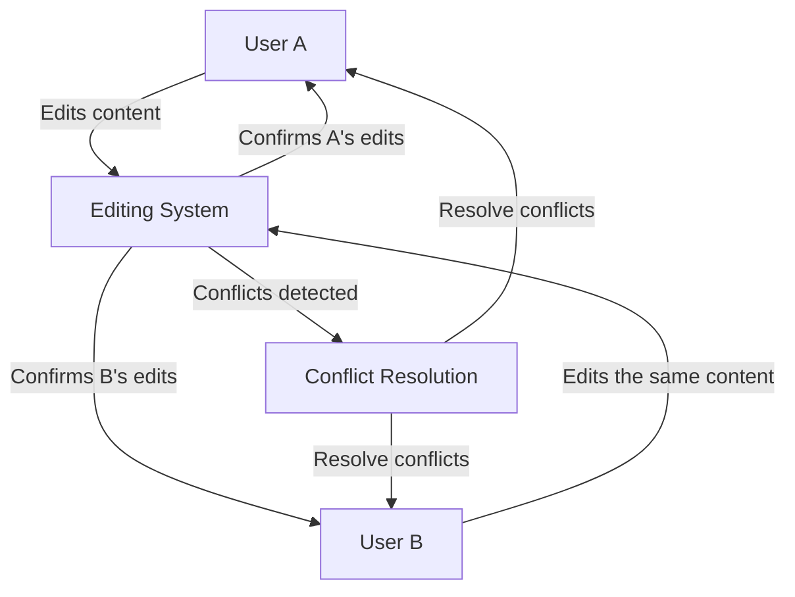

```mermaid
graph TD
    A[User A] -->|Edits content| B[Editing System]
    B -->|Confirms A's edits| A
    C[User B] -->|Edits the same content| B
    B -->|Confirms B's edits| C
    B -->|Conflicts detected| D[Conflict Resolution]
    D -->|Resolve conflicts| A
    D -->|Resolve conflicts| C

```