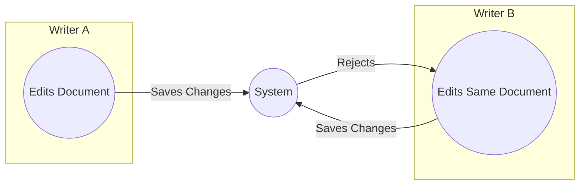

```mermaid
flowchart LR
subgraph Writer A
	direction TB
    a1((Edits Document))
end

subgraph Writer B
	direction TB
    b1((Edits Same Document))
end

a1 -->|Saves Changes| c((System))
b1 -->|Saves Changes| c
c -->|Rejects| b1
```