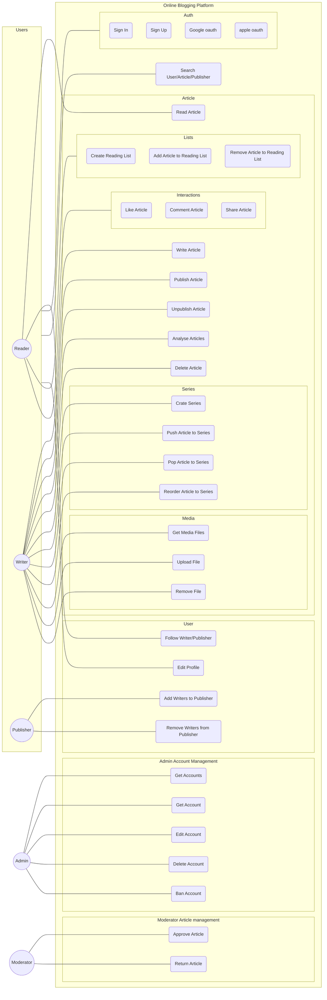
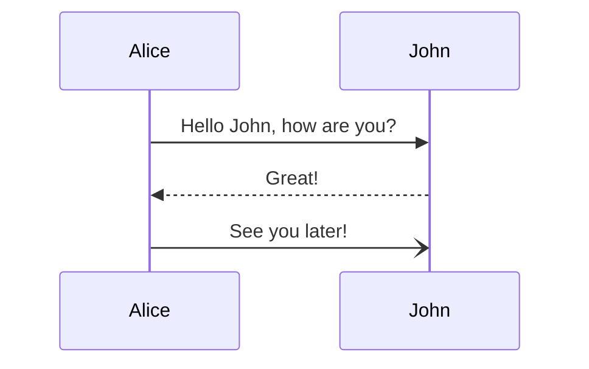
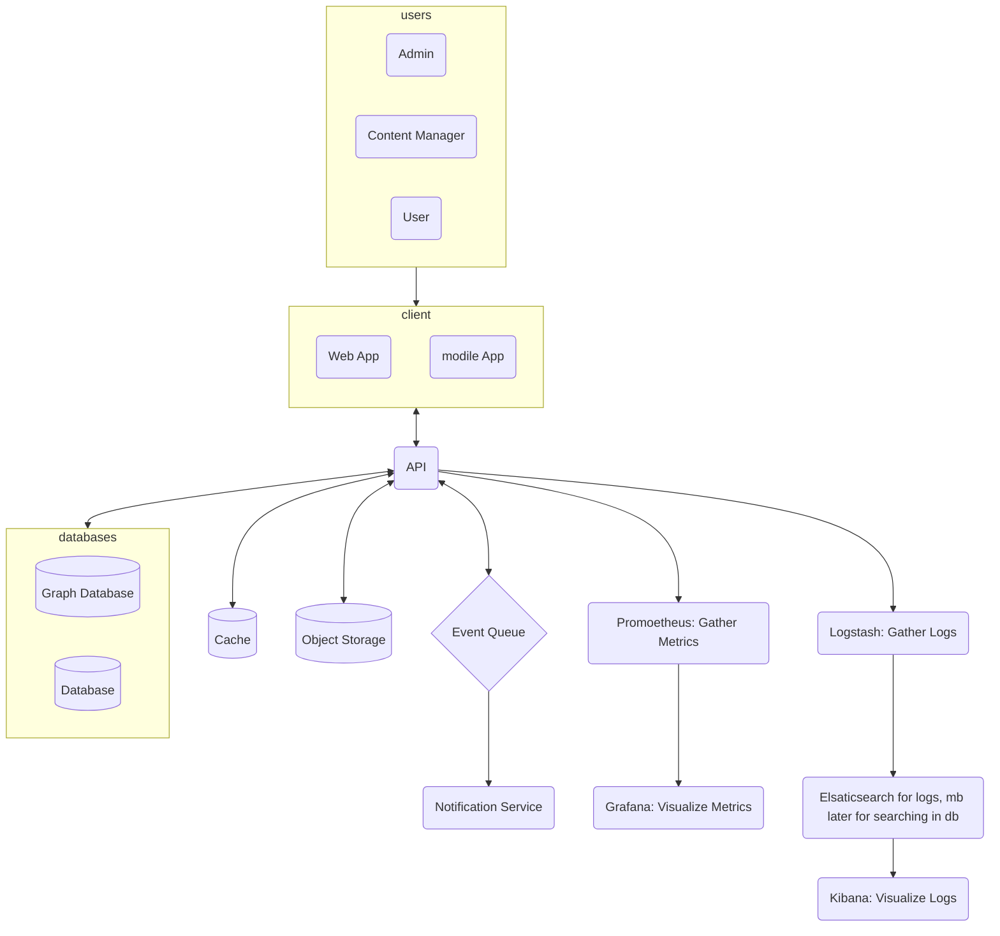
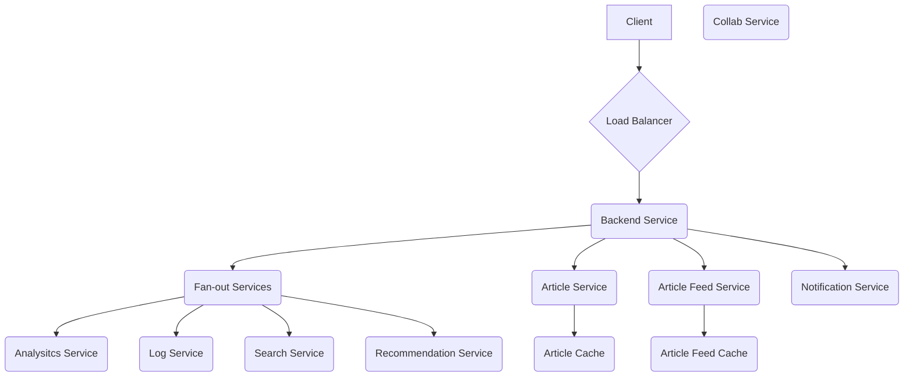

# Use Case



# Sequence Diagram


# Architecture

# System Design


# Components
```mermaid
flowchart TD

```
# Models
```mermaid
erDiagram
accounts {
	serial id PK "NOT NULL"  
	integer userId FK "NOT NULL"
	varchar type "NOT NULL"
	varchar provider "NOT NULL"
	varchar providerAccountId
	text refresh_token
	text access_token 
	bigint expires_at
	text token_type
	text scope
	text id_token
	text session_state
}

users {
	serial id PK
	varchar username UK
	varchar name
	varchar email
	timestampz emailVerified
	text image
	
	integer follower_count
	integer[] followers FK
	integer following_count
	integer[] following FK

	text[] urls

	interests

	enum role "ADMIN, MANAGER, USER. default USER"
	varchar(255) bio
}
sessions {
	serial id PK
	timestamp expires "NOT NULL"
	varchar sessionToken "NOT NULL"
	integer userid FK "NOT NULL"
}
verification_token {
	text identifier "NOT NULL"
	text token UK "NOT NULL"
	timestampz expires "NOT NULL"
}
users ||--|{ verification_token : ""
users ||--|{ sessions : ""
users ||--|{ accounts : ""

articles {
	bigint article_id PK
	varchar article_name
	varchar relative_path
	bigint checksum
	timestampz created_at
	timestampz last_modified
	integer series FK
	real series_order
	string[] tags FK
}
article_version {
	bigint article_version_id PK
	bigint article_id FK
	string device_id "uuid"
	bigint version_number
	timestampz last_modified
}
article_block {
	bigint block_id PK
	bigint article_version_id FK
	bigint block_order
	enum block_type FK "NOT NULL; DEFAULT text"
	text content
}
tags {
	text label PK
	int articleCount
}
series {
	serial id PK
	string author FK
	integer articles
}
articles }|--|| series
```