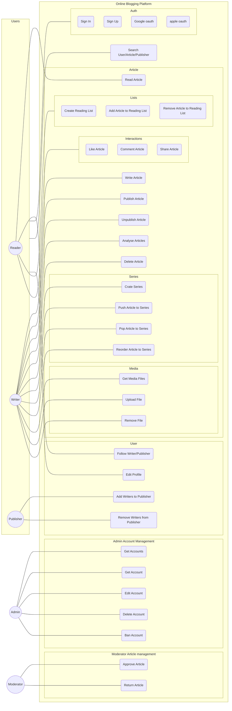
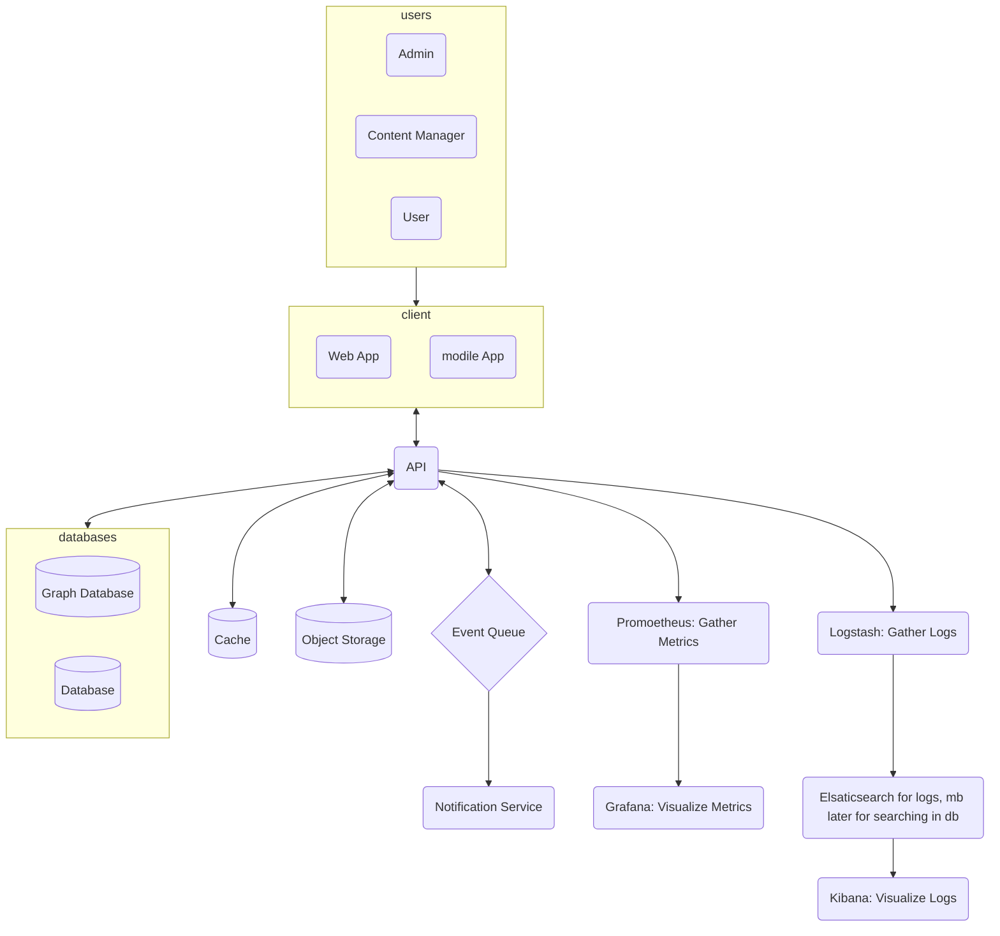
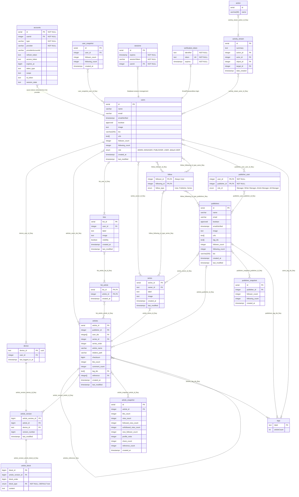

# Use Case

# Architecture

# Models


```mermaid
sequenceDiagram
    participant User
    participant Service
    participant Cache
    participant GraphDatabase
    participant ArticleDatabase

    User->>Service: opens a website
    activate Service
    Service->>Cache: post request for articles
    activate cache
    Cache-->>Service: array of articles
    deactivate Redis
    Service-->>User: shows articles
    deactivate Service

    alt article is open LESS than 100 sec
        User->>Service: opens an article
        activate Service
        Service->>Service: view_count
        activate Service
        deactivate Service
        User->>Service: closes the article
        deactivate Service
    else article is open MORE than 100 sec
        User->>Service: opens an article
        activate Service
        Service->>Service: view_count
        activate Service
        deactivate Service
        Service->>GraphDatabase: view_count +1
        activate GraphDatabase
        GraphDatabase-->>Service: success
        deactivate GraphDatabase
        deactivate Service
    end

    User->>Service: likes an article
    activate Service
    Service->>ArticleDa: like_count +1
    activate PostgreSQL
    PostgreSQL-->>Service: success
    deactivate PostgreSQL
    Service-->>User: shows in UI
    deactivate Service

    User->>Service: send a comment
    activate Service
    Service->>PostgreSQL: add comment
    activate PostgreSQL
    PostgreSQL-->>Service: success
    deactivate PostgreSQL
    Service-->>User: shows in UI
    deactivate Service
```