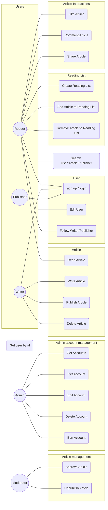
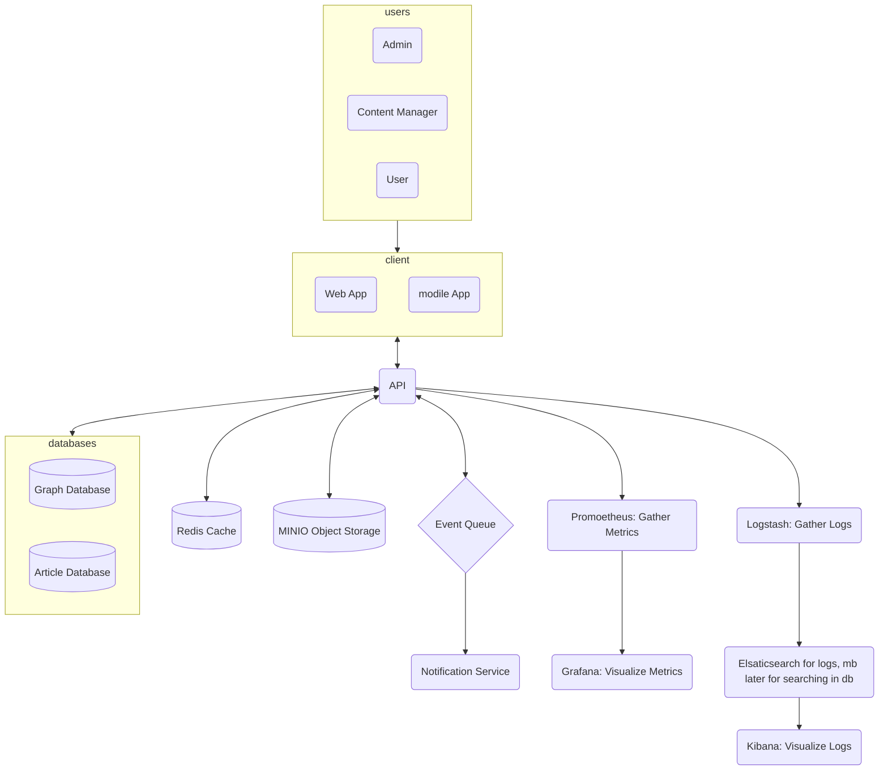
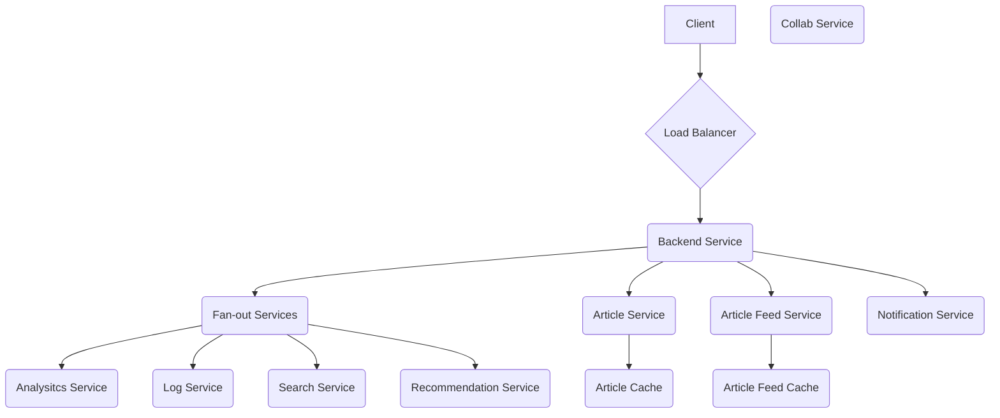
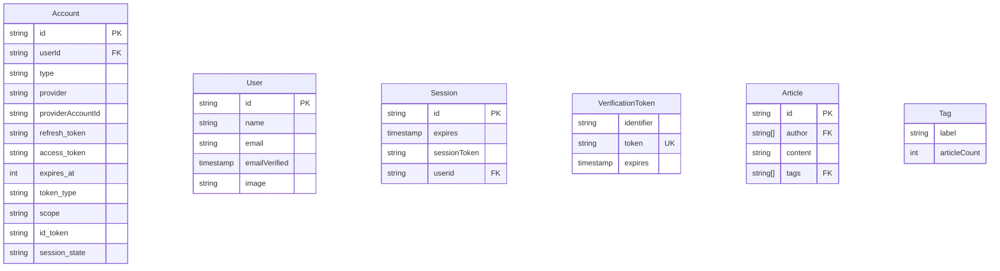
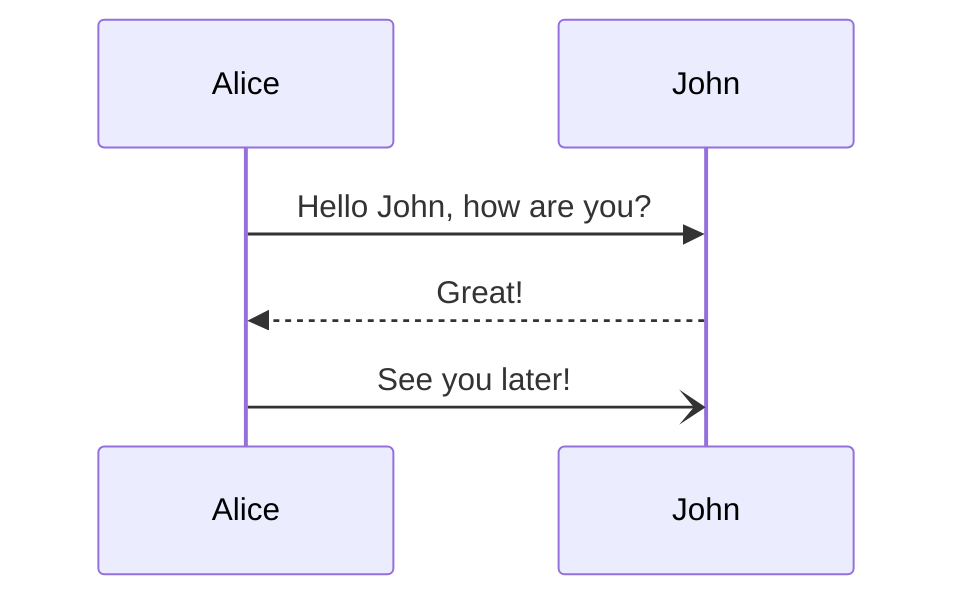

# Use Case

```mermaid
flowchart LR
subgraph Users
	r((Reader))
	w((Writer))
	p((Publisher))
end

a((Admin))
m((Moderator))

subgraph User
	auth(sign up / login)
	editUser(Edit User)
	follow(Follow Writer/Publisher)
end

search(Search User/Article/Publisher)

r --- auth
w --- auth
p --- auth
r --- follow
Users --- search
Users --- editUser

subgraph Article
	read(Read Article)
	write(Write Article)
	publish(Publish Article)
	delete(Delete Article)
end

w --- write
w --- publish
w --- delete
r --- read

subgraph Reading List
	direction TB
	crl(Create Reading List)
	arl(Add Article to Reading List)
	rrl(Remove Article to Reading List)
end

r --- crl
r --- arl
r --- rrl

getUser(Get user by id)
 
subgraph Article Interactions
	direction TB
	like(Like Article)
	comment(Comment Article)
	share(Share Article)
end

r --- like
r --- comment
r --- share

subgraph Admin account management
	direction TB
	getAccounts(Get Accounts)
	getAccount(Get Account)
	editAccount(Edit Account)
	deleteAccount(Delete Account)
	banAccount(Ban Account)
end

a --- getAccounts
a --- getAccount
a --- editAccount
a --- deleteAccount
a --- banAccount
 
subgraph Article management
	direction TB
	approveArticle(Approve Article)
	unpublishArticle(Unpublish Article)
end
m --- approveArticle
m --- unpublishArticle
```
# Architecture

```mermaid
flowchart TD
	subgraph users
		a(Admin)
		cm(Content Manager)
		u(User)
	end
	
	subgraph client
		direction TB
		web(Web App)
		modile(modile App)
	end
	
	api(API)
	
	redis[(Redis Cache)]
	subgraph databases
	direction LR
	    neo4j[(Graph Database)]
	    sql[(Article Database)]
	end
    minio[(MINIO Object Storage)]
    
    queue{Event Queue}
    ns(Notification Service)
    
    promoetheus(Promoetheus: Gather Metrics)
    grafana(Grafana: Visualize Metrics)
    logstash(Logstash: Gather Logs)
    
    elsaticsearch("Elsaticsearch for logs, mb later for searching in db")
    kibana(Kibana: Visualize Logs)
    
	users --> client
	client <--> api
	api <--> databases
	api <--> minio
	api <--> redis
	api <--> queue
	queue --> ns
	api --> logstash
	logstash --> elsaticsearch
	elsaticsearch --> kibana
	api --> promoetheus
	promoetheus --> grafana
```
# System Design

```mermaid  
flowchart TD
	client["Client"]
	lb{Load Balancer}
    
	bs(Backend Service)
    fan-out(Fan-out Services)
    rs(Recommendation Service)
    as(Analysitcs Service)
    ars(Article Service)
    ac(Article Cache)
    afs(Article Feed Service)
    afc(Article Feed Cache)
    ns(Notification Service)
    ls(Log Service)
    ss(Search Service)
    
	cs(Collab Service)
    
    client --> lb
    lb --> bs
    bs --> fan-out
    fan-out --> as 
    fan-out --> ls
    fan-out --> ss
    fan-out --> rs
    bs --> ns
    bs --> ars
    ars --> ac
    bs --> afs
    afs --> afc
```

# Components
```mermaid
flowchart TD

```
# Models

```mermaid
erDiagram
Account {
	string id PK  
	string userId FK  
	string type
	string provider  
	string providerAccountId  
	string refresh_token  
	string access_token  
	int expires_at  
	string token_type  
	string scope  
	string id_token  
	string session_state
}
User {
	string id PK
	string name
	string email
	timestamp emailVerified
	string image
}
Session {
	string id PK
	timestamp expires
	string sessionToken
	string userid FK
}
VerificationToken {
	string identifier
	string token UK
	timestamp expires
}
Article {
	string id PK
	string[] author FK
	string content
	string[] tags FK
}
Tag {
	string label
	int articleCount
}
```
# Sequence Diagram

```mermaid
sequenceDiagram
Alice ->> John: Hello John, how are you?
John -->> Alice: Great!
Alice -) John: See you later!
```